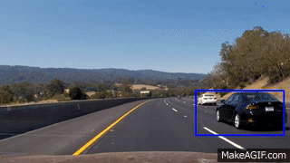

# Vehicle Detection

This prject detects the vehicle and tracks based on simple HOG feature extractor and a support vector classifier.

This is done as part of udacity self driving car engineer nano degree(https://www.udacity.com/drive).

The actual output of the project  [video](https://www.youtube.com/watch?v=8u36mS0113o&feature=youtu.be)
for more details [check](https://github.com/sumanth-nirmal/VehicleDetection/blob/master/writeup_report.md)

