## Vehicle Detection and Tracking

This is project done as a part of Udacity Slef driving car engineer nano degree (https://www.udacity.com/drive).

---

**Vehicle Detection Project**

The goals / steps of this project are the following:

* Perform a Histogram of Oriented Gradients (HOG) feature extraction on a labeled training set of images and train a classifier Linear SVM classifier
* Optionally, you can also apply a color transform and append binned color features, as well as histograms of color, to your HOG feature vector. 
* Note: for those first two steps don't forget to normalize your features and randomize a selection for training and testing.
* Implement a sliding-window technique and use your trained classifier to search for vehicles in images.
* Run your pipeline on a video stream (start with the test_video.mp4 and later implement on full project_video.mp4) and create a heat map of recurring detections frame by frame to reject outliers and follow detected vehicles.
* Estimate a bounding box for vehicles detected.

## Histogram of Oriented Gradients (HOG)

Histogram of Oriented Gradients (HOG) is an approach to get the features, this is implemented in *hog_features.py* as`fetchHOGFeatures`Hog features were extracted from both cars and non-cars. 
The following parameters are used for HOG:
* colour space = 'YCrCb'
* orient = 9
* pix_per_cell = 8
* cell_per_block = 2

The below images shows the features, features are extracted on all color channels, shown below:

Image with car     

channel 1 HOG features      
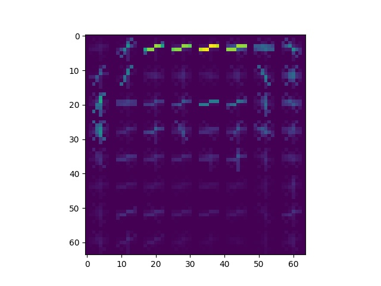 
channel 2 HOG features     
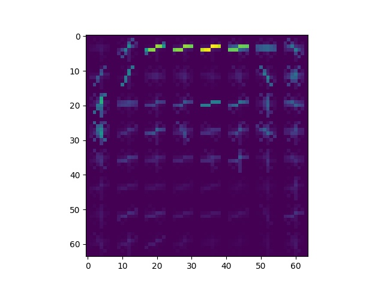 
channel 3 HOG features     
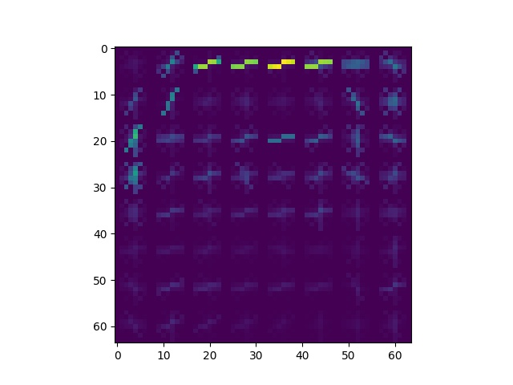

Image with out car      
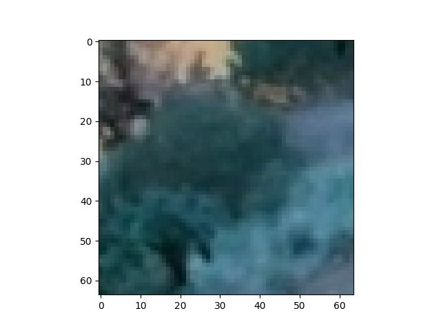  
channel 1 HOG features     
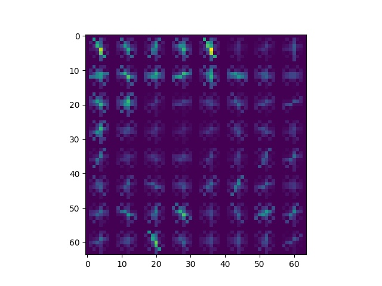
channel 2 HOG features     
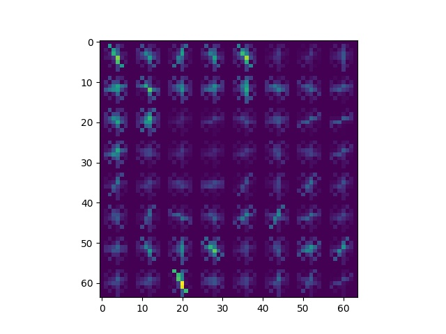 
channel 3 HOG features       
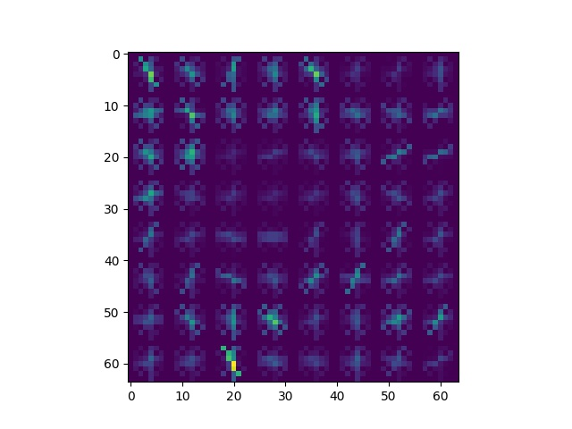

The HOG parameters are basically determined through trial and error. Orientation9 gave optimal results and 8 pixels per cell are choosen as its the size of the features. ALL channels are used to extract the features as it gives more information. YCrCb color space is used so it can also detect the white cars. hoistogram bins are choosen as 32 and cloor histogram and spatial binning is acheived using the functions `fetchHistFeatures` and `fetchSpatialBins`  in *hog_features.py*

## Training the Classifier

I used a support vector classifier with probability set to true. though this approach takes more time this provided more features being detected (Its a tradeoff). First the features were extracted and shuffled (To make sure it doesnt overfit). Then the data was split into training data and testing data with a 0.2 split. Then the model was trained and saved as a pcikle file

The code for this is available in *classifier.py* to run this` python classifier.py` this should get the features train a classifier and finally save the model as *model.p* (pickle file)

## Sliding Window Search

The basic idea of sliding window from the class is used here and the code can be found in *detectCar()* in *hog_features.py*. The HOG features are first extracted for the entire lower half of image and is then subsampled for each sliding window. 
It just steps through the X and Y axes and moves by cells_per_step extracting the features along the way.

I use probability estimates which gave more accurate detections and features are extracted using YCrCB 3-channel HOG extraction plus spatially binned color and histograms of color in the feature vector, this can be seen on some of the test images

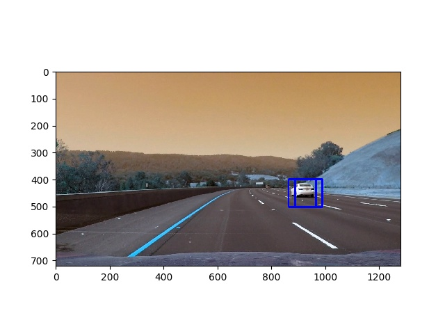
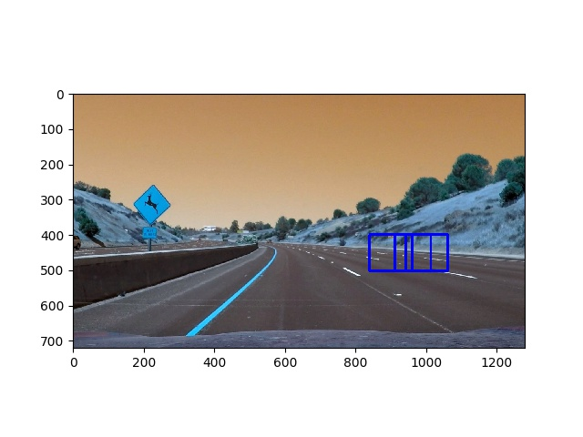
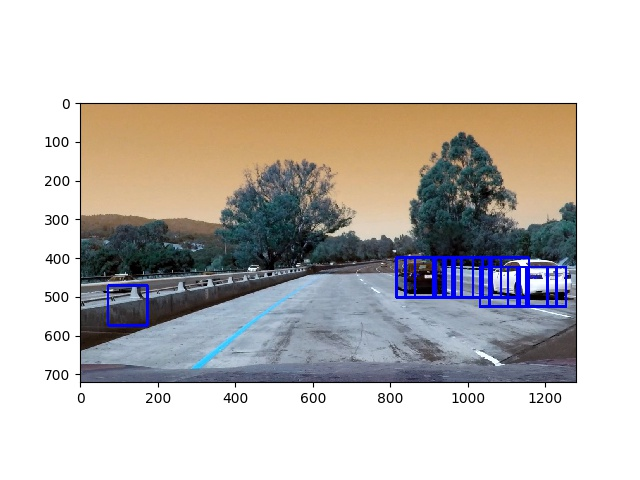
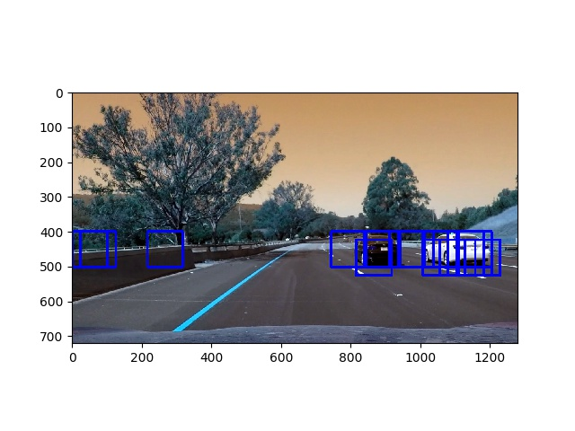
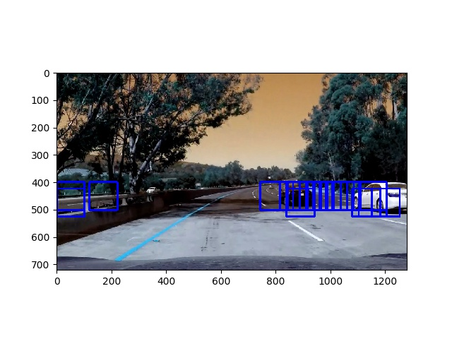
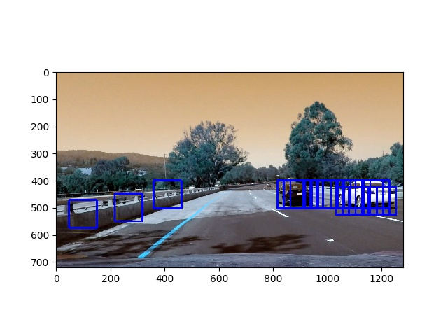

## Video Implementation

The working video can be seen [here](https://www.youtube.com/watch?v=8u36mS0113o&feature=youtu.be)

The idea to reduce the false positives is to use heat map though the classifier and feature extraction. the heat map is implemented as a function `addHeatMap()` in *hog_features.py*. Also used threshold which is implemented as `applythreshold()` in *hog_features.py*
*(anyways the false positive in this video with the current setup are very low)

The basic idea of a heat map generation is to innitialize heat-map image with dimension equals to the dimension of the input images and add +1 for all pixels within windows where car ois detected by classifier, so these parts are the cars and by imposing a threshold other areas are rejected (which are also false positives)

The heat map and thresholded images are shown below (applied on test images):

Input Image         |     Heat Map  | Thresholded   
---------------------------  | ------------ | ------------- 
  | 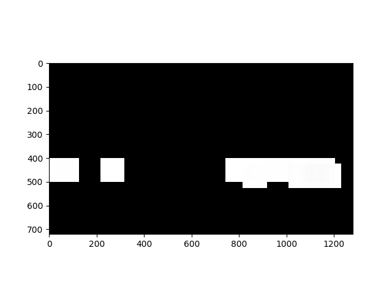 |

The bounding box drawn on the above detected image

## Discussion

* Getting false positives to zero is a challenge, though this particular input video has very little, but with a different input video this could really be challenging. One way to get to zero is by using heat maps as we used and thresholding the images.
* Also the hog method is very resource consuming, any alternative for this would improve the timing for training
* the pipeline can fail when there are shadows
* Using latest deppe learning methods to detect the features may be more promising
